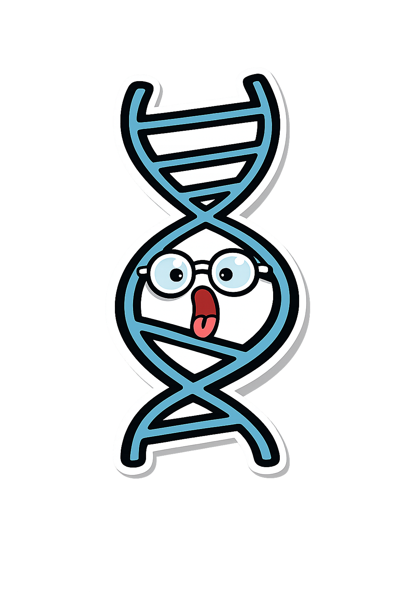

# GenePrint - DNA Signature Generator

GenePrint is an entertaining, deterministic DNA signature application that transforms any unique identifier, such as a username, email address, or custom string, into a reproducible genetic sequence and a stunning interactive 3D helix visualization.

### What is it
The core of GenePrint is a mathematical derivation engine that ensures identical inputs always produce identical results. It maps your unique digital fingerprint to a fixed-length DNA sequence consisting of A, C, G, and T bases, which then drives the generation of a high-fidelity 3D double helix.

### Key Features
- 100% Deterministic: Your unique identifier will always generate the exact same DNA signature.
- Interactive 3D Helix: Explore a biologically inspired 3D model with anatomically accurate major and minor grooves.
- Privacy-First: All processing happens entirely in your browser. No data is stored, transmitted, or persisted.
- Biotech Aesthetic: A refined, obsidian-themed laboratory interface designed for an immersive experience.
- Export Options: Capture the perfect angle of your DNA signature and export it as a PNG for sharing.

### How to Use
1. Input Your Sample: Enter any string into the Specimen ID field.
2. Observe the Derivation: Watch as the system instantly calculates your unique nucleotide sequence.
3. Explore the Helix: Use your mouse or touch to rotate, zoom, and inspect your 3D DNA model.
4. Export Your Signature: Use the "Export" button to save a high-resolution image of your unique genetic fingerprint.

---

  <i>Mathematically derived, 100% Client-side, Molecular Derivation Protocol v1.2</i>

